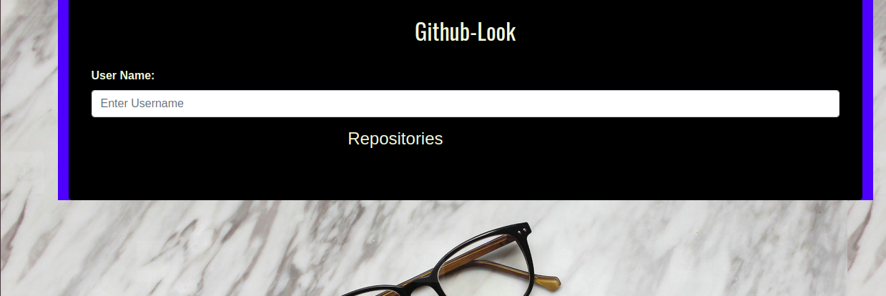

# Github-Look

## By Naomi-sigu

## Description
This is a web app where you can search for users by their names and find their repositories and their information and contact details if posted.

## Setup/Installation Requirements
- Open your terminal
- initialize github, git clone https://github.com/Naomi-sigu/githweb.git
- open folder in prefered IDE
- open terminal
- run "ng serve -o" to open the application in your localhost## Technologies Used
- HTML
- CSS
- Bootstrap
- Javascrpt
- Angular

# ScreenShot

# For help
For any user support, contact siguneema@gmail.com

## License
MIT LicenseCopyright (c) [2019] [Naomi Neema Sigu]Permission is hereby granted, free of charge, to any person obtaining a copy of this software and associated documentation files (the "Software"), to deal in the Software without restriction, including without limitation the rights to use, copy, modify, merge, publish, distribute, sublicense, and/or sell copies of the Software, and to permit persons to whom the Software is furnished to do so, subject to the following conditions:The above copyright notice and this permission notice shall be included in all copies or substantial portions of the Software.THE SOFTWARE IS PROVIDED "AS IS", WITHOUT WARRANTY OF ANY KIND, EXPRESS OR IMPLIED, INCLUDING BUT NOT LIMITED TO THE WARRANTIES OF MERCHANTABILITY, FITNESS FOR A PARTICULAR PURPOSE AND NONINFRINGEMENT. IN NO EVENT SHALL THE AUTHORS OR COPYRIGHT HOLDERS BE LIABLE FOR ANY CLAIM, DAMAGES OR OTHER LIABILITY, WHETHER IN AN ACTION OF CONTRACT, TORT OR OTHERWISE, ARISING FROM, OUT OF OR IN CONNECTION WITH THE SOFTWARE OR THE USE OR OTHER DEALINGS IN THE SOFTWARE.
